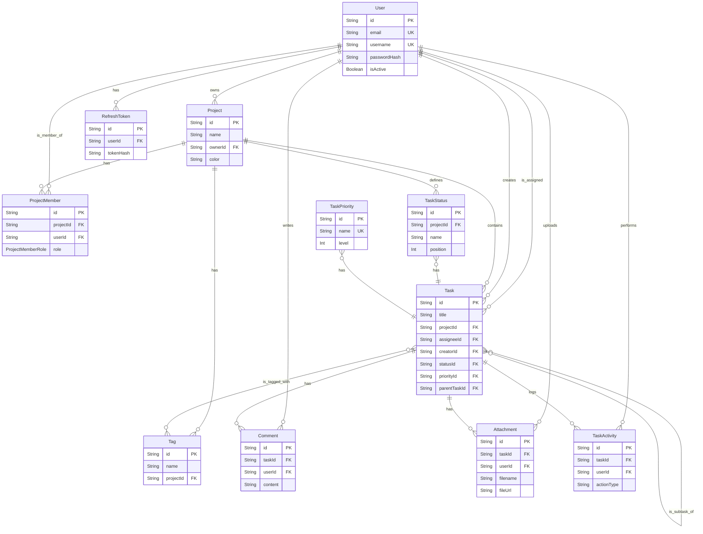

```mermaid
erDiagram
    User {
        String id PK
        String email UK
        String username UK
        String passwordHash
        Boolean isActive
    }

    Project {
        String id PK
        String name
        String ownerId FK
        String color
    }

    ProjectMember {
        String id PK
        String projectId FK
        String userId FK
        ProjectMemberRole role
    }

    Task {
        String id PK
        String title
        String projectId FK
        String assigneeId FK
        String creatorId FK
        String statusId FK
        String priorityId FK
        String parentTaskId FK
    }

    TaskStatus {
        String id PK
        String projectId FK
        String name
        Int position
    }

    TaskPriority {
        String id PK
        String name UK
        Int level
    }

    Tag {
        String id PK
        String name
        String projectId FK
    }

    Comment {
        String id PK
        String taskId FK
        String userId FK
        String content
    }

    Attachment {
        String id PK
        String taskId FK
        String userId FK
        String filename
        String fileUrl
    }

    TaskActivity {
        String id PK
        String taskId FK
        String userId FK
        String actionType
    }

    RefreshToken {
        String id PK
        String userId FK
        String tokenHash
    }

    %% --- 関係性の定義 ---
    User ||--o{ Project : "owns"
    User ||--o{ ProjectMember : "is_member_of"
    User ||--o{ Task : "is_assigned"
    User ||--o{ Task : "creates"
    User ||--o{ Comment : "writes"
    User ||--o{ Attachment : "uploads"
    User ||--o{ TaskActivity : "performs"
    User ||--o{ RefreshToken : "has"

    Project ||--o{ ProjectMember : "has"
    Project ||--o{ Task : "contains"
    Project ||--o{ TaskStatus : "defines"
    Project ||--o{ Tag : "has"

    TaskStatus }o--|| Task : "has"
    TaskPriority }o--|| Task : "has"
    Task }o--o{ Task : "is_subtask_of"
    Task ||--o{ Comment : "has"
    Task ||--o{ Attachment : "has"
    Task ||--o{ TaskActivity : "logs"
    Task }o--o{ Tag : "is_tagged_with"
```